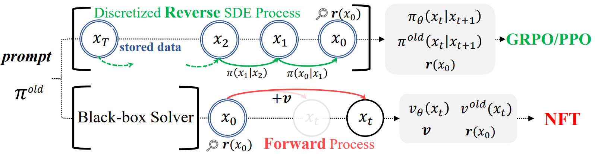
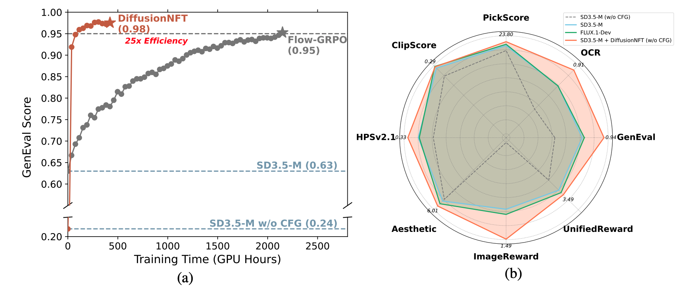

# ParetoSlider: Pareto-Set Learning for Multi-Objective Diffusion Model Alignment

<p align="center">
  
</p>

**ParetoSlider** trains a single diffusion model that spans the entire Pareto front of multiple (potentially conflicting) reward objectives. At inference time, a lightweight preference slider lets users navigate trade-offs — e.g. photorealism vs. sketch style — without retraining.

<p align="center">
  
</p>

## Key Ideas

- **Preference-conditioned LoRA** — A sinusoidal positional encoding of the preference vector is projected and injected into the diffusion transformer via residual block modulation, so one set of weights covers the full Pareto front.
- **Per-objective GRPO** — Each reward objective gets its own group-relative advantage, avoiding single-loss collapse where one strong signal drowns out the others.
- **Scalarization flexibility** — Supports linear, smooth Tchebycheff (sTch), augmented sTch, Lp, PBI, COSMOS, and exponential weighted scalarizations for different Pareto-front geometries.
- **Structured preference sampling** — Vertex / edge / interior sampling ensures the model sees corner and boundary solutions, not just smooth interior blends.

## Setup

### Prerequisites

- Python 3.10+
- CUDA-capable GPUs (training tested on 4–8 × A100/H100)
- A running reward server for Qwen-VL style rewards (see [Reward Servers](#reward-servers) below)

### Install

We recommend [uv](https://docs.astral.sh/uv/) for fast, reproducible environments:

```bash
cd T2I
pip install -r requirements.txt

# or, if using uv:
uv pip install -r requirements.txt
```

## Quick Start

### Training (Pareto-conditioned)

This trains a preference-conditioned LoRA on SD3.5-Medium with two objectives (photorealism + sketch style):

```bash
CUDA_VISIBLE_DEVICES=0,1,2,3 torchrun \
    --nproc_per_node=4 \
    --master-port=29501 \
    scripts/train_pareto_nft_sd3.py \
    --config "config/nft.py:sd3_qwen_style_sketch"
```

Available configs in `config/nft.py`:

| Config name | Description |
|---|---|
| `sd3_qwen_style_sketch` | Pareto front: photorealism vs. sketch style (default) |
| `sd3_qwen_sketch_photorealism_stch` | Same objectives, smooth Tchebycheff scalarization |
| `sd3_qwen_sketch_photorealism_single_loss` | Weighted-sum baseline (no per-objective loss) |
| `sd3_1_pickscore_photorealism_0_qwen_style_sketch` | Single-objective baseline (photorealism only) |

### Training (Unconditional / Single-Objective)

```bash
CUDA_VISIBLE_DEVICES=0,1,2,3 torchrun \
    --nproc_per_node=4 \
    --master-port=29501 \
    scripts/train_nft_sd3.py \
    --config "config/nft.py:sd3_1_pickscore_photorealism_0_qwen_style_sketch"
```

### Evaluation

Evaluate a trained checkpoint across a sweep of preference weights:

```bash
torchrun --nproc_per_node=4 scripts/conditional_evaluation.py \
    --checkpoint_dir logs/nft/sd3/<run_name>/checkpoints/checkpoint-<N> \
    --config "config/nft.py:sd3_qwen_style_sketch" \
    --output_dir evaluation_output \
    --num_steps 40
```

Generate images with specific preference settings:

```bash
python scripts/eval_preference.py \
    --checkpoint_dir logs/nft/sd3/<run_name>/checkpoints/checkpoint-<N> \
    --config "config/nft.py:sd3_qwen_style_sketch" \
    --output_dir preference_samples
```

## Reward Servers

Qwen-VL style rewards (e.g. `qwen_style_sketch`) require an external reward server. Set the URL via environment variable:

```bash
export QWEN_VL_REWARD_URL="http://localhost:12341"
```

The server should expose a `POST /mode/<mode>` endpoint accepting pickled `{"images": [...], "prompts": [...]}` payloads and returning pickled `{"scores": [...]}` responses.

## Project Structure

```
T2I/
├── config/
│   ├── base.py                  # Default hyperparameters
│   └── nft.py                   # Experiment configs (objectives, scalarization, LoRA)
├── flow_grpo/
│   ├── diffusers_patch/
│   │   ├── transformer_sd3.py   # SD3Transformer with preference conditioning (SliderProjector)
│   │   ├── pipeline_with_logprob.py  # SD3 pipeline with log-prob computation for GRPO
│   │   └── ...
│   ├── scalarization.py         # Linear, sTch, PBI, COSMOS, Lp, EW scalarizers
│   ├── preference_utils.py      # Structured preference sampling & GDPO advantages
│   ├── rewards.py               # Multi-reward orchestration
│   ├── *_scorer.py              # Individual reward model wrappers
│   └── ...
├── scripts/
│   ├── train_pareto_nft_sd3.py  # Main Pareto-conditioned training loop
│   ├── train_nft_sd3.py         # Unconditional / single-objective training
│   ├── conditional_evaluation.py # Evaluate across preference weight sweeps
│   ├── eval_preference.py       # Generate images at specific preference points
│   └── evaluation.py            # Standard checkpoint evaluation
└── dataset/                     # Prompt lists for training and evaluation
    ├── pickscore/
    ├── drawbench/
    ├── geneval/
    └── ocr/
```

## Configuration

Training is configured via `ml_collections` config files. Key parameters:

| Parameter | Description | Default |
|---|---|---|
| `loss_mode` | `"per_objective"` (Pareto) or `"single_loss"` (weighted sum) | `"single_loss"` |
| `conditioning_mode` | How preferences are injected: `"temb_blk_shared"`, `"hybrid"` | — |
| `scalarization` | Scalarization method: `"linear"`, `"stch"`, `"aug_stch"`, `"lp"`, `"pbi"`, `"cosmos"`, `"ew"` | `"linear"` |
| `num_pref_per_prompt` | K preference vectors per prompt per epoch (contrastive signal) | `1` |
| `block_mod_form` | Block modulation form: `"residual"`, `"affine"` | — |
| `train.lora_rank` | LoRA rank | `32` |
| `train.beta` | KL penalty coefficient | `0.0001` |

Environment variables:

| Variable | Description | Default |
|---|---|---|
| `NFT_LOGDIR` | Top-level log/checkpoint directory | `./logs` |
| `NFT_LORA_PATH` | Path to pre-trained LoRA weights (optional warm start) | — |
| `QWEN_VL_REWARD_URL` | Qwen-VL reward server URL | `http://127.0.0.1:12341` |

## License

This project is licensed under the [Apache License 2.0](LICENSE).

```
SPDX-FileCopyrightText: Copyright (c) 2025 NVIDIA CORPORATION & AFFILIATES. All rights reserved.
SPDX-License-Identifier: Apache-2.0
```
